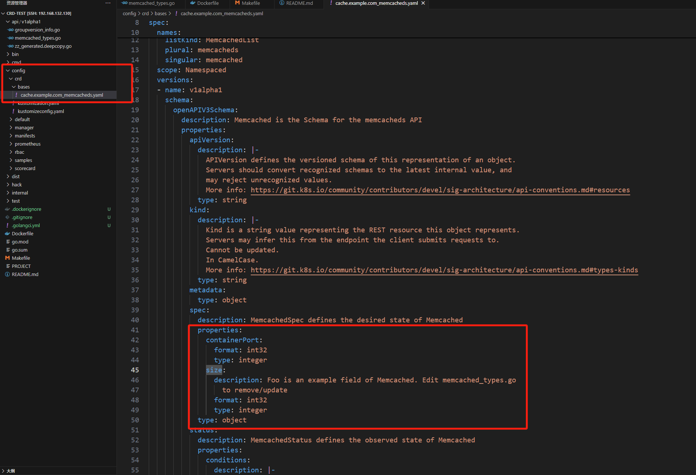
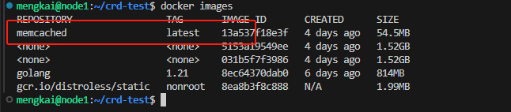
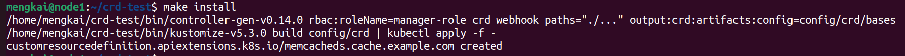
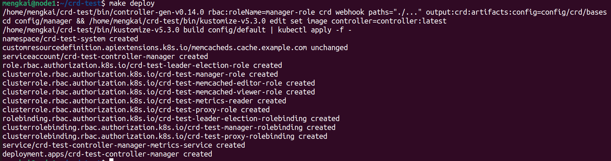
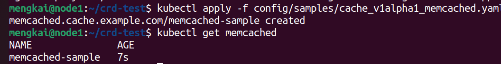

# 1.首先创建一个新的项目
mkdir -p $HOME/projects/memcached-operator
cd $HOME/projects/memcached-operator
operator-sdk init --domain example.com --repo github.com/example/memcached-operator

# 2.创建一个crd
operator-sdk create api --group cache --version v1alpha1 --kind Memcached --resource --controller

# 3.添加一些属性

# 4.make generate 调用 controller-gen 来生成 Kubernetes 的深度拷贝、客户端、CRD YAML 等代码。
 ### 比如：zz_generated.deepcopy.go：包含了自动生成的深度拷贝函数。深度拷贝函数用于创建结构体的深度拷贝，在 k8s 中，控制器通常需要对资源对象进行深度拷贝，以避免对共享状态的无意修改。
 ###  memcached_types.go：定义了自定义资源的 Go 结构体类型，以及 Spec 和 Status 字段。这个文件在执行 make generate 之前可能已经存在，但 make generate 会确保该文件中的代码符合最新的 CRD 定义要求。
 ###  groupversion_info.go：这个文件是 Go 的类型注册文件，定义了 API 组和版本的元信息。它告诉 Kubernetes API 服务器如何处理和识别你的 CRD 类型。

# 5.生成 CRD 的 k8s 资源清单（config/crd/bases 文件夹下的 CRD YAML 文件）。
###  cache.example.com_memcacheds.yaml：这个文件是生成的 CRD 定义文件，描述了自定义资源的 API 结构、验证规则、默认值等。它定义了如何在 Kubernetes 集群中创建和管理该 CRD 的实例。
###  cache_v1alpha1_memcached.yaml：这是一个示例文件，描述了如何创建一个具体的自定义资源实例
make manifests

# 6.镜像编译和推送
make docker-build IMG=memcached-operator:latest
make docker-push IMG=memcached-operator:latest

# 7.将CRD安装到k8s
make install

# 8.控制器部署到k8s
make deploy

# 9.测试CRD,创建一个 Memcached 自定义资源对象来测试 CRD 和控制器，然后查看创建的资源：
kubectl apply -f config/samples/cache_v1alpha1_memcached.yaml
kubectl get memcached

# 10.获取各个 Operator 组件的日志信息
kubectl logs -l control-plane=controller-manager -n crd-test-system --tail=20
- **镜像拉取出了问题，暂时没成功**